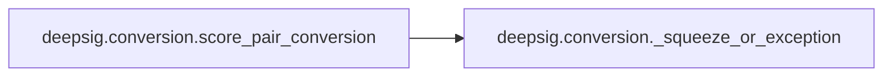
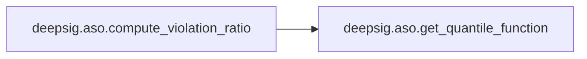
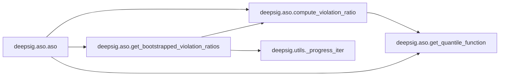
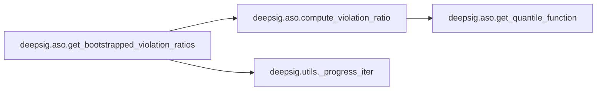
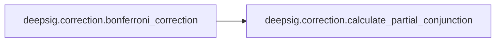
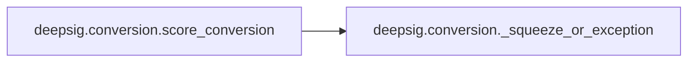
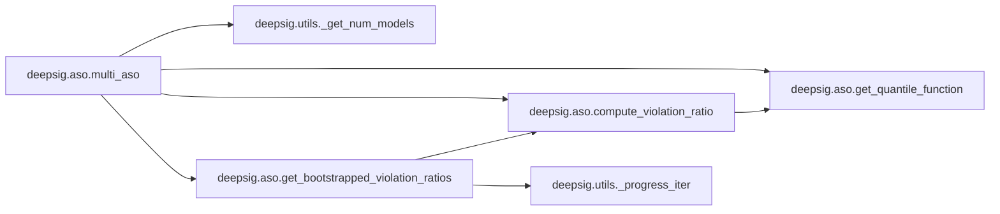

# Key Objects

[_Documentation generated by Documatic_](https://www.documatic.com)

<!---Documatic-section-deepsig.conversion.score_pair_conversion-start--->
## deepsig.conversion.score_pair_conversion

<!---Documatic-section-score_pair_conversion-start--->


### Object Calls

* deepsig.conversion._squeeze_or_exception

<!---Documatic-block-deepsig.conversion.score_pair_conversion-start--->
<details>
	<summary><code>deepsig.conversion.score_pair_conversion</code> code snippet</summary>

```python
def score_pair_conversion(func: Callable) -> Callable:

    @wraps(func)
    def with_score_pair_conversion(scores_a: ArrayLike, scores_b: ArrayLike, *args, **kwargs):
        conversion_func_a = CONVERSIONS[type(scores_a)]
        conversion_func_b = CONVERSIONS[type(scores_b)]
        scores_a = conversion_func_a(scores_a)
        scores_b = conversion_func_b(scores_b)

        def _squeeze_or_exception(array: np.array, name: str) -> np.array:
            dims = len(array.shape)
            if dims > 1:
                if dims == 2 and array.shape[-1] == 1:
                    array = np.squeeze(array, axis=1)
                else:
                    raise TypeError('{} has to be one-dimensional, {} found.'.format(name, dims))
            return array
        scores_a = _squeeze_or_exception(scores_a, 'scores_a')
        scores_b = _squeeze_or_exception(scores_b, 'scores_b')
        return func(scores_a, scores_b, *args, **kwargs)
    return with_score_pair_conversion
```
</details>
<!---Documatic-block-deepsig.conversion.score_pair_conversion-end--->
<!---Documatic-section-score_pair_conversion-end--->

# #
<!---Documatic-section-deepsig.conversion.score_pair_conversion-end--->

<!---Documatic-section-deepsig.sample_size.aso_uncertainty_reduction-start--->
## deepsig.sample_size.aso_uncertainty_reduction

<!---Documatic-section-aso_uncertainty_reduction-start--->
<!---Documatic-block-deepsig.sample_size.aso_uncertainty_reduction-start--->
<details>
	<summary><code>deepsig.sample_size.aso_uncertainty_reduction</code> code snippet</summary>

```python
def aso_uncertainty_reduction(m_old: int, n_old: int, m_new: int, n_new: int) -> float:
    assert all((sample_size >= 1 for sample_size in [m_old, n_old, m_new, n_new])), 'All sample sizes have to be larger than or equal to 1.'
    assert all((type(sample_size) == int for sample_size in [m_old, n_old, m_new, n_new])), 'Sample sizes have to be integers.'
    return sqrt((m_old + n_old) * m_new * n_new / (m_old * n_old * (m_new + n_new)))
```
</details>
<!---Documatic-block-deepsig.sample_size.aso_uncertainty_reduction-end--->
<!---Documatic-section-aso_uncertainty_reduction-end--->

# #
<!---Documatic-section-deepsig.sample_size.aso_uncertainty_reduction-end--->

<!---Documatic-section-deepsig.utils._progress_iter-start--->
## deepsig.utils._progress_iter

<!---Documatic-section-_progress_iter-start--->
<!---Documatic-block-deepsig.utils._progress_iter-start--->
<details>
	<summary><code>deepsig.utils._progress_iter</code> code snippet</summary>

```python
def _progress_iter(high: int, progress_bar: tqdm):
    current = 0
    while current < high:
        yield current
        current += 1
        progress_bar.update(1)
```
</details>
<!---Documatic-block-deepsig.utils._progress_iter-end--->
<!---Documatic-section-_progress_iter-end--->

# #
<!---Documatic-section-deepsig.utils._progress_iter-end--->

<!---Documatic-section-deepsig.utils._get_num_models-start--->
## deepsig.utils._get_num_models

<!---Documatic-section-_get_num_models-start--->
<!---Documatic-block-deepsig.utils._get_num_models-start--->
<details>
	<summary><code>deepsig.utils._get_num_models</code> code snippet</summary>

```python
def _get_num_models(scores: ScoreCollection) -> int:
    if isinstance(scores, dict):
        if len(scores) < 2:
            raise ValueError("'scores' argument should contain at least two sets of scores, but only {} found.".format(len(scores)))
        return len(scores)
    elif isinstance(scores, list):
        if not isinstance(scores[0], list):
            raise TypeError("'scores' argument must be nested list of scores when Python lists are used, but elements of type {} found".format(type(scores[0]).__name__))
        return len(scores)
    elif type(scores) in ALLOWED_TYPES:
        scores = CONVERSIONS[type(scores)](scores)
        return scores.shape[0]
    raise TypeError("Invalid type for 'scores', should be nested Python list, dict, Jax / Numpy array or Tensorflow / PyTorch tensor, '{}' found.".format(type(scores).__name__))
```
</details>
<!---Documatic-block-deepsig.utils._get_num_models-end--->
<!---Documatic-section-_get_num_models-end--->

# #
<!---Documatic-section-deepsig.utils._get_num_models-end--->

<!---Documatic-section-deepsig.correction.calculate_partial_conjunction-start--->
## deepsig.correction.calculate_partial_conjunction

<!---Documatic-section-calculate_partial_conjunction-start--->
<!---Documatic-block-deepsig.correction.calculate_partial_conjunction-start--->
<details>
	<summary><code>deepsig.correction.calculate_partial_conjunction</code> code snippet</summary>

```python
def calculate_partial_conjunction(sorted_p_values: np.array, u: int) -> float:
    N = len(sorted_p_values)
    p_partial_u = (N - u + 1) * sorted_p_values[u - 1]
    return p_partial_u
```
</details>
<!---Documatic-block-deepsig.correction.calculate_partial_conjunction-end--->
<!---Documatic-section-calculate_partial_conjunction-end--->

# #
<!---Documatic-section-deepsig.correction.calculate_partial_conjunction-end--->

<!---Documatic-section-deepsig.aso.compute_violation_ratio-start--->
## deepsig.aso.compute_violation_ratio

<!---Documatic-section-compute_violation_ratio-start--->


### Object Calls

* deepsig.aso.get_quantile_function

<!---Documatic-block-deepsig.aso.compute_violation_ratio-start--->
<details>
	<summary><code>deepsig.aso.compute_violation_ratio</code> code snippet</summary>

```python
def compute_violation_ratio(scores_a: Optional[np.array]=None, scores_b: Optional[np.array]=None, quantile_func_a: Optional[Callable]=None, quantile_func_b: Optional[Callable]=None, dt: float=0.001) -> float:
    assert scores_a is not None or quantile_func_a is not None, 'Either scores or quantile function are required for the first sample, neither found.'
    assert scores_b is not None or quantile_func_b is not None, 'Either scores or quantile function are required for the second sample, neither found.'
    if quantile_func_a is None:
        quantile_func_a = get_quantile_function(scores_a)
    if quantile_func_b is None:
        quantile_func_b = get_quantile_function(scores_b)
    t = np.arange(dt, 1, dt)
    f = quantile_func_a(t)
    g = quantile_func_b(t)
    diff = g - f
    squared_wasserstein_dist = np.sum(diff ** 2 * dt)
    diff[f >= g] = 0
    int_violation_set = np.sum(diff[1:] ** 2 * dt)
    if squared_wasserstein_dist == 0:
        warn('Division by zero encountered in violation ratio.')
        violation_ratio = 0.5
    else:
        violation_ratio = int_violation_set / squared_wasserstein_dist
    return violation_ratio
```
</details>
<!---Documatic-block-deepsig.aso.compute_violation_ratio-end--->
<!---Documatic-section-compute_violation_ratio-end--->

# #
<!---Documatic-section-deepsig.aso.compute_violation_ratio-end--->

<!---Documatic-section-deepsig.conversion._squeeze_or_exception-start--->
## deepsig.conversion._squeeze_or_exception

<!---Documatic-section-_squeeze_or_exception-start--->
<!---Documatic-block-deepsig.conversion._squeeze_or_exception-start--->
<details>
	<summary><code>deepsig.conversion._squeeze_or_exception</code> code snippet</summary>

```python
def _squeeze_or_exception(array: np.array, name: str) -> np.array:
    dims = len(array.shape)
    if dims > 1:
        if dims == 2 and array.shape[-1] == 1:
            array = np.squeeze(array, axis=1)
        else:
            raise TypeError('{} has to be one-dimensional, {} found.'.format(name, dims))
    return array
```
</details>
<!---Documatic-block-deepsig.conversion._squeeze_or_exception-end--->
<!---Documatic-section-_squeeze_or_exception-end--->

# #
<!---Documatic-section-deepsig.conversion._squeeze_or_exception-end--->

<!---Documatic-section-deepsig.aso.aso-start--->
## deepsig.aso.aso

<!---Documatic-section-aso-start--->


### Object Calls

* deepsig.aso.compute_violation_ratio
* deepsig.aso.get_quantile_function
* deepsig.aso.get_bootstrapped_violation_ratios

<!---Documatic-block-deepsig.aso.aso-start--->
<details>
	<summary><code>deepsig.aso.aso</code> code snippet</summary>

```python
@score_pair_conversion
def aso(scores_a: ArrayLike, scores_b: ArrayLike, confidence_level: float=0.95, num_comparisons: int=1, num_samples: int=1000, num_bootstrap_iterations: int=1000, dt: float=0.005, num_jobs: int=1, show_progress: bool=True, seed: Optional[int]=None, _progress_bar: Optional[tqdm]=None) -> float:
    assert len(scores_a) > 0 and len(scores_b) > 0, 'Both lists of scores must be non-empty.'
    assert num_bootstrap_iterations > 0, 'num_samples must be positive, {} found.'.format(num_bootstrap_iterations)
    assert num_jobs > 0 or num_jobs == -1, 'Number of jobs has to be at least 1 or -1, {} found.'.format(num_jobs)
    assert num_comparisons > 0, 'Number of comparisons has to be at least 1, {} found.'.format(num_comparisons)
    if num_jobs == -1:
        num_jobs = psutil.cpu_count(logical=True)
        if num_jobs is None:
            warn('Number of available CPUs could not be determined, setting num_jobs=1.')
            num_jobs = 1
    if num_samples != 1000:
        warn("'num_samples' argument is being ignored in the current version and will be deprecated in version 1.3!", DeprecationWarning)
    if confidence_level < 0.95:
        warn(f"'confidence_level' was refactored in version 1.2.4 to be more intuitive and usually should be in the .95 -.99 range, but {confidence_level} was found. If you tried to adjust the confidence level for multiple comparisons, try the new num_comparisons argument instead.", UserWarning)
    if num_comparisons > 1:
        confidence_level += (1 - confidence_level) / num_comparisons
    violation_ratio = compute_violation_ratio(scores_a=scores_a, scores_b=scores_b, dt=dt)
    quantile_func_a = get_quantile_function(scores_a)
    quantile_func_b = get_quantile_function(scores_b)
    samples = get_bootstrapped_violation_ratios(scores_a, scores_b, quantile_func_a, quantile_func_b, num_bootstrap_iterations, dt, num_jobs, show_progress, seed, _progress_bar)
    samples = np.array(samples)
    const = np.sqrt(len(scores_a) * len(scores_b) / (len(scores_a) + len(scores_b)))
    sigma_hat = np.std(const * (samples - violation_ratio))
    min_epsilon = np.clip(violation_ratio - 1 / const * sigma_hat * normal.ppf(1 - confidence_level), 0, 1)
    return min_epsilon
```
</details>
<!---Documatic-block-deepsig.aso.aso-end--->
<!---Documatic-section-aso-end--->

# #
<!---Documatic-section-deepsig.aso.aso-end--->

<!---Documatic-section-deepsig.aso.get_quantile_function-start--->
## deepsig.aso.get_quantile_function

<!---Documatic-section-get_quantile_function-start--->
<!---Documatic-block-deepsig.aso.get_quantile_function-start--->
<details>
	<summary><code>deepsig.aso.get_quantile_function</code> code snippet</summary>

```python
def get_quantile_function(scores: np.array) -> Callable:
    if 'np' not in dir():
        import numpy as np

    def _quantile_function(p: float) -> float:
        cdf = np.sort(scores)
        num = len(scores)
        index = int(np.ceil(num * p))
        return cdf[np.clip(index - 1, 0, num - 1)]
    return np.vectorize(_quantile_function)
```
</details>
<!---Documatic-block-deepsig.aso.get_quantile_function-end--->
<!---Documatic-section-get_quantile_function-end--->

# #
<!---Documatic-section-deepsig.aso.get_quantile_function-end--->

<!---Documatic-section-deepsig.aso.get_bootstrapped_violation_ratios-start--->
## deepsig.aso.get_bootstrapped_violation_ratios

<!---Documatic-section-get_bootstrapped_violation_ratios-start--->


### Object Calls

* deepsig.aso.compute_violation_ratio
* deepsig.utils._progress_iter

<!---Documatic-block-deepsig.aso.get_bootstrapped_violation_ratios-start--->
<details>
	<summary><code>deepsig.aso.get_bootstrapped_violation_ratios</code> code snippet</summary>

```python
def get_bootstrapped_violation_ratios(scores_a: ArrayLike, scores_b: ArrayLike, quantile_func_a: Callable, quantile_func_b: Callable, num_bootstrap_iterations: int, dt: float, num_jobs: int, show_progress: bool, seed: Optional[int], _progress_bar: Optional[tqdm]) -> List[float]:
    if show_progress and _progress_bar is None:
        iters = tqdm(range(num_bootstrap_iterations), desc='Bootstrap iterations')
    elif _progress_bar is not None:
        iters = _progress_iter(num_bootstrap_iterations, _progress_bar)
    else:
        iters = range(num_bootstrap_iterations)
    seeds = [None] * num_bootstrap_iterations if seed is None else [seed + offset for offset in range(1, num_bootstrap_iterations + 1)]

    @wrap_non_picklable_objects
    def _bootstrap_iter(seed: Optional[int]=None):
        """
        One bootstrap iteration. Wrapped in a function so it can be handed to joblib.Parallel.
        """
        if 'numpy' not in dir() or 'deepsig' not in dir():
            import numpy as np
            from deepsig.aso import compute_violation_ratio
        if seed is not None:
            np.random.seed(seed)
        sampled_scores_a = quantile_func_a(np.random.uniform(0, 1, len(scores_a)))
        sampled_scores_b = quantile_func_b(np.random.uniform(0, 1, len(scores_b)))
        sample = compute_violation_ratio(scores_a=sampled_scores_a, scores_b=sampled_scores_b, dt=dt)
        return sample
    parallel = Parallel(n_jobs=num_jobs)
    samples = parallel((delayed(_bootstrap_iter)(seed) for (seed, _) in zip(seeds, iters)))
    return samples
```
</details>
<!---Documatic-block-deepsig.aso.get_bootstrapped_violation_ratios-end--->
<!---Documatic-section-get_bootstrapped_violation_ratios-end--->

# #
<!---Documatic-section-deepsig.aso.get_bootstrapped_violation_ratios-end--->

<!---Documatic-section-deepsig.bootstrap.bootstrap_test-start--->
## deepsig.bootstrap.bootstrap_test

<!---Documatic-section-bootstrap_test-start--->
<!---Documatic-block-deepsig.bootstrap.bootstrap_test-start--->
<details>
	<summary><code>deepsig.bootstrap.bootstrap_test</code> code snippet</summary>

```python
@score_pair_conversion
def bootstrap_test(scores_a: ArrayLike, scores_b: ArrayLike, num_samples: int=1000, num_jobs: int=1, seed: Optional[int]=None) -> float:
    assert len(scores_a) == len(scores_b), 'Scores have to be of same length.'
    assert len(scores_a) > 0 and len(scores_b) > 0, 'Both lists of scores must be non-empty.'
    assert num_samples > 0, 'num_samples must be positive, {} found.'.format(num_samples)
    N = len(scores_a)
    delta = np.mean(scores_a) - np.mean(scores_b)
    seeds = [None] * num_samples if seed is None else [seed + offset for offset in range(1, num_samples + 1)]

    def _bootstrap_iter(delta: float, seed: Optional[int]=None):
        """
        One bootstrap iteration. Wrapped in a function so it can be handed to joblib.Parallel.
        """
        if 'np' not in dir():
            import numpy as np
        if seed is not None:
            np.random.seed(seed)
        resampled_scores_a = np.random.choice(scores_a, N)
        resampled_scores_b = np.random.choice(scores_b, N)
        new_delta = np.mean(resampled_scores_a - resampled_scores_b)
        return int(new_delta >= 2 * delta)
    parallel = Parallel(n_jobs=num_jobs)
    samples = parallel((delayed(_bootstrap_iter)(delta, seed) for (_, seed) in zip(range(num_samples), seeds)))
    p_value = sum(samples) / num_samples
    return p_value
```
</details>
<!---Documatic-block-deepsig.bootstrap.bootstrap_test-end--->
<!---Documatic-section-bootstrap_test-end--->

# #
<!---Documatic-section-deepsig.bootstrap.bootstrap_test-end--->

<!---Documatic-section-deepsig.permutation.permutation_test-start--->
## deepsig.permutation.permutation_test

<!---Documatic-section-permutation_test-start--->
<!---Documatic-block-deepsig.permutation.permutation_test-start--->
<details>
	<summary><code>deepsig.permutation.permutation_test</code> code snippet</summary>

```python
@score_pair_conversion
def permutation_test(scores_a: ArrayLike, scores_b: ArrayLike, num_samples: int=1000, num_jobs: int=1, seed: Optional[int]=None) -> float:
    assert len(scores_a) == len(scores_b), 'Scores have to be of same length.'
    assert len(scores_a) > 0 and len(scores_b) > 0, 'Both lists of scores must be non-empty.'
    assert num_samples > 0, 'num_samples must be positive, {} found.'.format(num_samples)
    N = len(scores_a)
    delta = np.mean(scores_a - scores_b)
    seeds = [None] * num_samples if seed is None else [seed + offset for offset in range(1, num_samples + 1)]

    def _bootstrap_iter(delta: float, seed: Optional[int]=None):
        """
        One bootstrap iteration. Wrapped in a function so it can be handed to joblib.Parallel.
        """
        if 'np' not in dir():
            import numpy as np
        if seed is not None:
            np.random.seed(seed)
        (swapped_a, swapped_b) = zip(*[(scores_a[i], scores_b[i]) if np.random.rand() > 0.5 else (scores_b[i], scores_a[i]) for i in range(N)])
        (swapped_a, swapped_b) = (np.array(swapped_a), np.array(swapped_b))
        return int(np.mean(swapped_a - swapped_b) >= delta)
    parallel = Parallel(n_jobs=num_jobs)
    samples = parallel((delayed(_bootstrap_iter)(delta, seed) for (_, seed) in zip(range(num_samples), seeds)))
    p_value = (sum(samples) + 1) / (num_samples + 1)
    return p_value
```
</details>
<!---Documatic-block-deepsig.permutation.permutation_test-end--->
<!---Documatic-section-permutation_test-end--->

# #
<!---Documatic-section-deepsig.permutation.permutation_test-end--->

<!---Documatic-section-deepsig.correction.bonferroni_correction-start--->
## deepsig.correction.bonferroni_correction

<!---Documatic-section-bonferroni_correction-start--->


### Object Calls

* deepsig.correction.calculate_partial_conjunction

<!---Documatic-block-deepsig.correction.bonferroni_correction-start--->
<details>
	<summary><code>deepsig.correction.bonferroni_correction</code> code snippet</summary>

```python
@score_conversion
def bonferroni_correction(p_values: ArrayLike) -> np.array:
    assert len(p_values) > 0, 'List of p-values must not be empty.'
    assert (0 <= p_values).all() and (p_values <= 1).all(), 'Input contains invalid p-values.'
    N = len(p_values)
    p_values = p_values.copy()
    if N == 1:
        return p_values
    indices = range(N)
    (p_values, sorted_indices) = zip(*sorted(zip(p_values, indices), key=lambda t: t[0]))
    (p_values, sorted_indices) = (np.array(p_values), np.array(sorted_indices))
    corrected_p_values = np.ones(N)
    for u in range(N):
        corrected_p_values[u] = calculate_partial_conjunction(p_values, u + 1)
    corrected_p_values = np.minimum(corrected_p_values, 1)
    corrected_p_values = corrected_p_values[sorted_indices]
    return corrected_p_values
```
</details>
<!---Documatic-block-deepsig.correction.bonferroni_correction-end--->
<!---Documatic-section-bonferroni_correction-end--->

# #
<!---Documatic-section-deepsig.correction.bonferroni_correction-end--->

<!---Documatic-section-deepsig.sample_size.bootstrap_power_analysis-start--->
## deepsig.sample_size.bootstrap_power_analysis

<!---Documatic-section-bootstrap_power_analysis-start--->
<!---Documatic-block-deepsig.sample_size.bootstrap_power_analysis-start--->
<details>
	<summary><code>deepsig.sample_size.bootstrap_power_analysis</code> code snippet</summary>

```python
@score_conversion
def bootstrap_power_analysis(scores: ArrayLike, scalar: float=1.25, num_bootstrap_iterations: int=5000, significance_threshold: float=0.05, significance_test: Optional[Callable]=None, show_progress: bool=True, seed: Optional[int]=None) -> float:
    assert len(scores) > 0, 'Lists of scores must be non-empty.'
    assert num_bootstrap_iterations > 0, 'Number of bootstrap iterations should be positive'
    assert scalar > 1, 'Lift should be larger than 1 to produce significant differences.'
    if seed is not None:
        np.random.seed(seed)
    if significance_test is None:
        significance_test = lambda scores_a, scores_b: ttest_rel(scores_a, scores_b, alternative='greater').pvalue
    iters = range(num_bootstrap_iterations) if not show_progress else tqdm(range(num_bootstrap_iterations))
    scores_lifted = scores + abs(scores) * (scalar - 1)
    N = len(scores)
    num_significant = 0
    for _ in iters:
        resampled_scores = np.random.choice(scores, N)
        resampled_scores_lifted = np.random.choice(scores_lifted, N)
        p_value = significance_test(resampled_scores_lifted, resampled_scores)
        num_significant += int(p_value <= significance_threshold)
    num_significant /= num_bootstrap_iterations
    return num_significant
```
</details>
<!---Documatic-block-deepsig.sample_size.bootstrap_power_analysis-end--->
<!---Documatic-section-bootstrap_power_analysis-end--->

# #
<!---Documatic-section-deepsig.sample_size.bootstrap_power_analysis-end--->

<!---Documatic-section-deepsig.conversion.score_conversion-start--->
## deepsig.conversion.score_conversion

<!---Documatic-section-score_conversion-start--->


### Object Calls

* deepsig.conversion._squeeze_or_exception

<!---Documatic-block-deepsig.conversion.score_conversion-start--->
<details>
	<summary><code>deepsig.conversion.score_conversion</code> code snippet</summary>

```python
def score_conversion(func: Callable) -> Callable:

    @wraps(func)
    def with_score_conversion(scores: ArrayLike, *args, **kwargs):
        conversion_func = CONVERSIONS[type(scores)]
        scores = conversion_func(scores)
        scores = _squeeze_or_exception(scores, 'p_values')
        return func(scores, *args, **kwargs)
    return with_score_conversion
```
</details>
<!---Documatic-block-deepsig.conversion.score_conversion-end--->
<!---Documatic-section-score_conversion-end--->

# #
<!---Documatic-section-deepsig.conversion.score_conversion-end--->

<!---Documatic-section-deepsig.aso.multi_aso-start--->
## deepsig.aso.multi_aso

<!---Documatic-section-multi_aso-start--->


### Object Calls

* deepsig.utils._get_num_models
* deepsig.aso.get_quantile_function
* deepsig.aso.compute_violation_ratio
* deepsig.aso.get_bootstrapped_violation_ratios

<!---Documatic-block-deepsig.aso.multi_aso-start--->
<details>
	<summary><code>deepsig.aso.multi_aso</code> code snippet</summary>

```python
def multi_aso(scores: ScoreCollection, confidence_level: float=0.95, use_bonferroni: bool=True, use_symmetry: bool=True, num_samples: int=1000, num_bootstrap_iterations: int=1000, dt: float=0.005, num_jobs: int=1, return_df: bool=False, show_progress: bool=True, seed: Optional[int]=None) -> Union[np.array, pd.DataFrame]:
    assert num_jobs > 0 or num_jobs == -1, 'Number of jobs has to be at least 1 or -1, {} found.'.format(num_jobs)
    if num_jobs == -1:
        num_jobs = psutil.cpu_count(logical=True)
        if num_jobs is None:
            warn('Number of available CPUs could not be determined, setting num_jobs=1.')
            num_jobs = 1
    if num_samples != 1000:
        warn("'num_samples' argument is being ignored in the current version and will be deprecated in version 1.3!", DeprecationWarning)
    if not use_symmetry:
        warn("'use_symmetry' argument is being ignored in the current version and will be deprecated in version 1.3!", DeprecationWarning)
    if confidence_level < 0.95:
        warn(f"'confidence_level' was refactored in version 1.2.4 to be more intuitive and usually should be in the .95 -.99 range, but {confidence_level} was found.", UserWarning)
    num_models = _get_num_models(scores)
    num_comparisons = num_models * (num_models - 1) / 2
    eps_min = np.eye(num_models)
    if use_bonferroni:
        confidence_level += (1 - confidence_level) / num_comparisons
    indices = list(range(num_models)) if type(scores) != dict else list(scores.keys())
    progress_bar = None
    if show_progress:
        progress_bar = tqdm(range(int(num_comparisons * num_bootstrap_iterations)) if use_symmetry else range(int(num_comparisons * num_bootstrap_iterations * 2)), desc='Model comparisons')
    for (i, key_i) in enumerate(indices):
        for (j, key_j) in enumerate(indices[i + 1:], start=i + 1):
            (scores_a, scores_b) = (scores[key_i], scores[key_j])
            quantile_func_a = get_quantile_function(scores_a)
            quantile_func_b = get_quantile_function(scores_b)
            const = np.sqrt(len(scores_a) * len(scores_b) / (len(scores_a) + len(scores_b)))
            violation_ratio_ab = compute_violation_ratio(dt=dt, quantile_func_a=quantile_func_a, quantile_func_b=quantile_func_b)
            violation_ratio_ba = 1 - violation_ratio_ab
            samples_ab = get_bootstrapped_violation_ratios(scores_a, scores_b, quantile_func_a, quantile_func_b, num_bootstrap_iterations, dt, num_jobs, show_progress, seed, progress_bar)
            samples_ab = np.array(samples_ab)
            sigma_hat = np.std(const * (samples_ab - violation_ratio_ab))
            min_epsilon_ab = np.clip(violation_ratio_ab - 1 / const * sigma_hat * normal.ppf(1 - confidence_level), 0, 1)
            min_epsilon_ba = np.clip(violation_ratio_ba - 1 / const * sigma_hat * normal.ppf(1 - confidence_level), 0, 1)
            eps_min[i, j] = min_epsilon_ab
            eps_min[j, i] = min_epsilon_ba
    if type(scores) == dict and return_df:
        eps_min = pd.DataFrame(data=eps_min, index=list(scores.keys()))
        eps_min = eps_min.rename(dict(enumerate(scores.keys())), axis=1)
    return eps_min
```
</details>
<!---Documatic-block-deepsig.aso.multi_aso-end--->
<!---Documatic-section-multi_aso-end--->

# #
<!---Documatic-section-deepsig.aso.multi_aso-end--->

<!---Documatic-section-deepsig.conversion.extend_type-start--->
## deepsig.conversion.extend_type

<!---Documatic-section-extend_type-start--->
<!---Documatic-block-deepsig.conversion.extend_type-start--->
<details>
	<summary><code>deepsig.conversion.extend_type</code> code snippet</summary>

```python
def extend_type(type_: type, new_type: type) -> type:
    type_.__args__ = (new_type, *type_.__args__)
    return type_
```
</details>
<!---Documatic-block-deepsig.conversion.extend_type-end--->
<!---Documatic-section-extend_type-end--->

# #
<!---Documatic-section-deepsig.conversion.extend_type-end--->

[_Documentation generated by Documatic_](https://www.documatic.com)