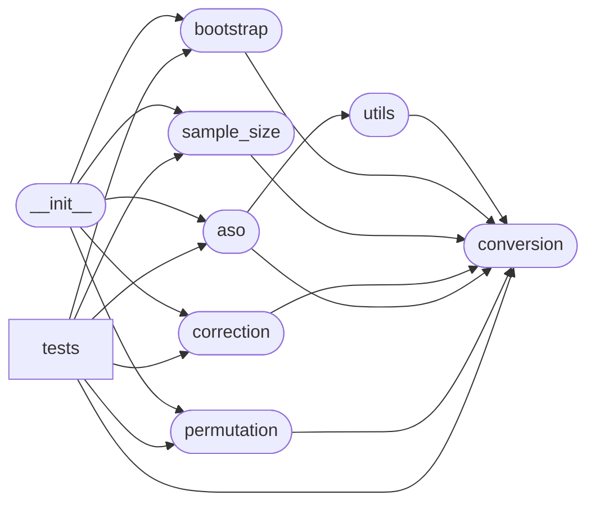

# Code Overview

[_Documentation generated by Documatic_](https://www.documatic.com)

<!---Documatic-section-Codebase Structure Python-start--->
## Codebase Structure Python

The codebase has a single-depth folder structure,
                with 14 code files in total.

<!---Documatic-block-system_architecture-start--->

<!---Documatic-block-system_architecture-end--->

# #
<!---Documatic-section-Codebase Structure Python-end--->

<!---Documatic-section-Key Objects-start--->
## Key Objects

There are exposed imports at level-0
from the source directory (deepsig)

<!---Documatic-block-deepsig-start--->

	
<code>deepsig</code> (Click to Expand!)

* `deepsig.aso.aso`
* `deepsig.aso.multi_aso`
* `deepsig.bootstrap.bootstrap_test`
* `deepsig.correction.bonferroni_correction`
* `deepsig.permutation.permutation_test`
* `deepsig.sample_size.aso_uncertainty_reduction`
* `deepsig.sample_size.bootstrap_power_analysis`

<!---Documatic-block-deepsig-end--->

# #
<!---Documatic-section-Key Objects-end--->

<!---Documatic-section-Important Functions-start--->
## Important Functions

<!---Documatic-block-important_funcs-start--->
<!---Documatic-block-most_used_funcs-start--->
### Most Utilised Functions

* [deepsig.conversion.score_pair_conversion](9-deepsig_conversion.md#deepsig.conversion.score_pair_conversion) (3 times)
* [deepsig.bootstrap.bootstrap_test](4-deepsig_bootstrap.md#deepsig.bootstrap.bootstrap_test) (3 times)
* [deepsig.correction.bonferroni_correction](6-deepsig_correction.md#deepsig.correction.bonferroni_correction) (3 times)
* [deepsig.permutation.permutation_test](8-deepsig_permutation.md#deepsig.permutation.permutation_test) (3 times)
* [deepsig.conversion.score_conversion](9-deepsig_conversion.md#deepsig.conversion.score_conversion) (2 times)
* [deepsig.aso.compute_violation_ratio](7-deepsig_aso.md#deepsig.aso.compute_violation_ratio) (2 times)
* [deepsig.aso.aso](7-deepsig_aso.md#deepsig.aso.aso) (2 times)
* [deepsig.aso.multi_aso](7-deepsig_aso.md#deepsig.aso.multi_aso) (2 times)
* deepsig.sample_size.aso_uncertainty_reduction (2 times)
* deepsig.sample_size.bootstrap_power_analysis (2 times)
* [deepsig.utils._progress_iter](3-deepsig_utils.md#deepsig.utils._progress_iter) (1 times)
* [deepsig.utils._get_num_models](3-deepsig_utils.md#deepsig.utils._get_num_models) (1 times)
* [deepsig.aso.get_quantile_function](7-deepsig_aso.md#deepsig.aso.get_quantile_function) (1 times)
<!---Documatic-block-most_used_funcs-end--->

<!---Documatic-block-end_user_funcs-start--->
### End User Exposed Functions

* [deepsig.aso.aso](7-deepsig_aso.md#deepsig.aso.aso)
* deepsig.sample_size.aso_uncertainty_reduction
* [deepsig.bootstrap.bootstrap_test](4-deepsig_bootstrap.md#deepsig.bootstrap.bootstrap_test)
* [deepsig.permutation.permutation_test](8-deepsig_permutation.md#deepsig.permutation.permutation_test)
* [deepsig.correction.bonferroni_correction](6-deepsig_correction.md#deepsig.correction.bonferroni_correction)
* deepsig.sample_size.bootstrap_power_analysis
* [deepsig.aso.multi_aso](7-deepsig_aso.md#deepsig.aso.multi_aso)
<!---Documatic-block-end_user_funcs-end--->
<!---Documatic-block-important_funcs-end--->

# #
<!---Documatic-section-Important Functions-end--->

<!---Documatic-section-Class Hierarchy-start--->
## Class Hierarchy

<!---Documatic-block-unittest.TestCase-start--->

	
<code>unittest.TestCase</code> (Click to Expand!)

* deepsig.tests.test_aso.ASOSanityChecks
* deepsig.tests.test_aso.ASOTechnicalTests
* deepsig.tests.test_aso.MultiASOTests
* deepsig.tests.test_bootstrap_permutation.BootstrapPermutationTests
* deepsig.tests.test_conversion.ConversionTests
* deepsig.tests.test_correction.CorrectionTests
* deepsig.tests.test_sample_size.ASOUncertaintyReductionTests
* deepsig.tests.test_sample_size.BootstrapPowerAnalysisTests

<!---Documatic-block-unittest.TestCase-end--->

# #
<!---Documatic-section-Class Hierarchy-end--->

[_Documentation generated by Documatic_](https://www.documatic.com)