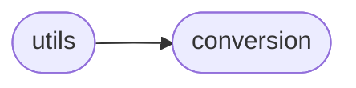

# Deepsig Utils

[_Documentation generated by Documatic_](https://www.documatic.com)

<!---Documatic-section-Codebase Structure-start--->
## Codebase Structure

<!---Documatic-block-system_architecture-start--->

<!---Documatic-block-system_architecture-end--->

# #
<!---Documatic-section-Codebase Structure-end--->

<!---Documatic-section-deepsig.utils._progress_iter-start--->
## [deepsig.utils._progress_iter](3-deepsig_utils.md#deepsig.utils._progress_iter)

<!---Documatic-section-_progress_iter-start--->
<!---Documatic-block-deepsig.utils._progress_iter-start--->
<details>
	<summary><code>deepsig.utils._progress_iter</code> code snippet</summary>

```python
def _progress_iter(high: int, progress_bar: tqdm):
    current = 0
    while current < high:
        yield current
        current += 1
        progress_bar.update(1)
```
</details>
<!---Documatic-block-deepsig.utils._progress_iter-end--->
<!---Documatic-section-_progress_iter-end--->

# #
<!---Documatic-section-deepsig.utils._progress_iter-end--->

<!---Documatic-section-deepsig.utils._get_num_models-start--->
## [deepsig.utils._get_num_models](3-deepsig_utils.md#deepsig.utils._get_num_models)

<!---Documatic-section-_get_num_models-start--->
<!---Documatic-block-deepsig.utils._get_num_models-start--->
<details>
	<summary><code>deepsig.utils._get_num_models</code> code snippet</summary>

```python
def _get_num_models(scores: ScoreCollection) -> int:
    if isinstance(scores, dict):
        if len(scores) < 2:
            raise ValueError("'scores' argument should contain at least two sets of scores, but only {} found.".format(len(scores)))
        return len(scores)
    elif isinstance(scores, list):
        if not isinstance(scores[0], list):
            raise TypeError("'scores' argument must be nested list of scores when Python lists are used, but elements of type {} found".format(type(scores[0]).__name__))
        return len(scores)
    elif type(scores) in ALLOWED_TYPES:
        scores = CONVERSIONS[type(scores)](scores)
        return scores.shape[0]
    raise TypeError("Invalid type for 'scores', should be nested Python list, dict, Jax / Numpy array or Tensorflow / PyTorch tensor, '{}' found.".format(type(scores).__name__))
```
</details>
<!---Documatic-block-deepsig.utils._get_num_models-end--->
<!---Documatic-section-_get_num_models-end--->

# #
<!---Documatic-section-deepsig.utils._get_num_models-end--->

[_Documentation generated by Documatic_](https://www.documatic.com)