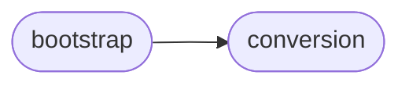

# Deepsig Bootstrap

[_Documentation generated by Documatic_](https://www.documatic.com)

<!---Documatic-section-Codebase Structure-start--->
## Codebase Structure

<!---Documatic-block-system_architecture-start--->

<!---Documatic-block-system_architecture-end--->

# #
<!---Documatic-section-Codebase Structure-end--->

<!---Documatic-section-deepsig.bootstrap.bootstrap_test-start--->
## [deepsig.bootstrap.bootstrap_test](4-deepsig_bootstrap.md#deepsig.bootstrap.bootstrap_test)

<!---Documatic-section-bootstrap_test-start--->
<!---Documatic-block-deepsig.bootstrap.bootstrap_test-start--->
<details>
	<summary><code>deepsig.bootstrap.bootstrap_test</code> code snippet</summary>

```python
@score_pair_conversion
def bootstrap_test(scores_a: ArrayLike, scores_b: ArrayLike, num_samples: int=1000, num_jobs: int=1, seed: Optional[int]=None) -> float:
    assert len(scores_a) == len(scores_b), 'Scores have to be of same length.'
    assert len(scores_a) > 0 and len(scores_b) > 0, 'Both lists of scores must be non-empty.'
    assert num_samples > 0, 'num_samples must be positive, {} found.'.format(num_samples)
    N = len(scores_a)
    delta = np.mean(scores_a) - np.mean(scores_b)
    seeds = [None] * num_samples if seed is None else [seed + offset for offset in range(1, num_samples + 1)]

    def _bootstrap_iter(delta: float, seed: Optional[int]=None):
        """
        One bootstrap iteration. Wrapped in a function so it can be handed to joblib.Parallel.
        """
        if 'np' not in dir():
            import numpy as np
        if seed is not None:
            np.random.seed(seed)
        resampled_scores_a = np.random.choice(scores_a, N)
        resampled_scores_b = np.random.choice(scores_b, N)
        new_delta = np.mean(resampled_scores_a - resampled_scores_b)
        return int(new_delta >= 2 * delta)
    parallel = Parallel(n_jobs=num_jobs)
    samples = parallel((delayed(_bootstrap_iter)(delta, seed) for (_, seed) in zip(range(num_samples), seeds)))
    p_value = sum(samples) / num_samples
    return p_value
```
</details>
<!---Documatic-block-deepsig.bootstrap.bootstrap_test-end--->
<!---Documatic-section-bootstrap_test-end--->

# #
<!---Documatic-section-deepsig.bootstrap.bootstrap_test-end--->

[_Documentation generated by Documatic_](https://www.documatic.com)