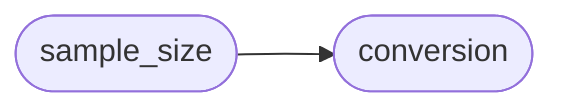

# Deepsig Sample Size

[_Documentation generated by Documatic_](https://www.documatic.com)

<!---Documatic-section-Codebase Structure-start--->
## Codebase Structure

<!---Documatic-block-system_architecture-start--->

<!---Documatic-block-system_architecture-end--->

# #
<!---Documatic-section-Codebase Structure-end--->

<!---Documatic-section-deepsig.sample_size.aso_uncertainty_reduction-start--->
## deepsig.sample_size.aso_uncertainty_reduction

<!---Documatic-section-aso_uncertainty_reduction-start--->
<!---Documatic-block-deepsig.sample_size.aso_uncertainty_reduction-start--->
<details>
	<summary><code>deepsig.sample_size.aso_uncertainty_reduction</code> code snippet</summary>

```python
def aso_uncertainty_reduction(m_old: int, n_old: int, m_new: int, n_new: int) -> float:
    assert all((sample_size >= 1 for sample_size in [m_old, n_old, m_new, n_new])), 'All sample sizes have to be larger than or equal to 1.'
    assert all((type(sample_size) == int for sample_size in [m_old, n_old, m_new, n_new])), 'Sample sizes have to be integers.'
    return sqrt((m_old + n_old) * m_new * n_new / (m_old * n_old * (m_new + n_new)))
```
</details>
<!---Documatic-block-deepsig.sample_size.aso_uncertainty_reduction-end--->
<!---Documatic-section-aso_uncertainty_reduction-end--->

# #
<!---Documatic-section-deepsig.sample_size.aso_uncertainty_reduction-end--->

<!---Documatic-section-deepsig.sample_size.bootstrap_power_analysis-start--->
## deepsig.sample_size.bootstrap_power_analysis

<!---Documatic-section-bootstrap_power_analysis-start--->
<!---Documatic-block-deepsig.sample_size.bootstrap_power_analysis-start--->
<details>
	<summary><code>deepsig.sample_size.bootstrap_power_analysis</code> code snippet</summary>

```python
@score_conversion
def bootstrap_power_analysis(scores: ArrayLike, scalar: float=1.25, num_bootstrap_iterations: int=5000, significance_threshold: float=0.05, significance_test: Optional[Callable]=None, show_progress: bool=True, seed: Optional[int]=None) -> float:
    assert len(scores) > 0, 'Lists of scores must be non-empty.'
    assert num_bootstrap_iterations > 0, 'Number of bootstrap iterations should be positive'
    assert scalar > 1, 'Lift should be larger than 1 to produce significant differences.'
    if seed is not None:
        np.random.seed(seed)
    if significance_test is None:
        significance_test = lambda scores_a, scores_b: ttest_rel(scores_a, scores_b, alternative='greater').pvalue
    iters = range(num_bootstrap_iterations) if not show_progress else tqdm(range(num_bootstrap_iterations))
    scores_lifted = scores + abs(scores) * (scalar - 1)
    N = len(scores)
    num_significant = 0
    for _ in iters:
        resampled_scores = np.random.choice(scores, N)
        resampled_scores_lifted = np.random.choice(scores_lifted, N)
        p_value = significance_test(resampled_scores_lifted, resampled_scores)
        num_significant += int(p_value <= significance_threshold)
    num_significant /= num_bootstrap_iterations
    return num_significant
```
</details>
<!---Documatic-block-deepsig.sample_size.bootstrap_power_analysis-end--->
<!---Documatic-section-bootstrap_power_analysis-end--->

# #
<!---Documatic-section-deepsig.sample_size.bootstrap_power_analysis-end--->

[_Documentation generated by Documatic_](https://www.documatic.com)