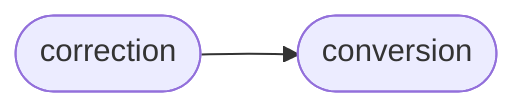
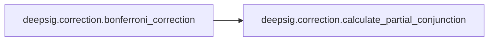

# Deepsig Correction

[_Documentation generated by Documatic_](https://www.documatic.com)

<!---Documatic-section-Codebase Structure-start--->
## Codebase Structure

<!---Documatic-block-system_architecture-start--->

<!---Documatic-block-system_architecture-end--->

# #
<!---Documatic-section-Codebase Structure-end--->

<!---Documatic-section-deepsig.correction.bonferroni_correction-start--->
## [deepsig.correction.bonferroni_correction](6-deepsig_correction.md#deepsig.correction.bonferroni_correction)

<!---Documatic-section-bonferroni_correction-start--->


### Object Calls

* [deepsig.correction.calculate_partial_conjunction](6-deepsig_correction.md#deepsig.correction.calculate_partial_conjunction)

<!---Documatic-block-deepsig.correction.bonferroni_correction-start--->
<details>
	<summary><code>deepsig.correction.bonferroni_correction</code> code snippet</summary>

```python
@score_conversion
def bonferroni_correction(p_values: ArrayLike) -> np.array:
    assert len(p_values) > 0, 'List of p-values must not be empty.'
    assert (0 <= p_values).all() and (p_values <= 1).all(), 'Input contains invalid p-values.'
    N = len(p_values)
    p_values = p_values.copy()
    if N == 1:
        return p_values
    indices = range(N)
    (p_values, sorted_indices) = zip(*sorted(zip(p_values, indices), key=lambda t: t[0]))
    (p_values, sorted_indices) = (np.array(p_values), np.array(sorted_indices))
    corrected_p_values = np.ones(N)
    for u in range(N):
        corrected_p_values[u] = calculate_partial_conjunction(p_values, u + 1)
    corrected_p_values = np.minimum(corrected_p_values, 1)
    corrected_p_values = corrected_p_values[sorted_indices]
    return corrected_p_values
```
</details>
<!---Documatic-block-deepsig.correction.bonferroni_correction-end--->
<!---Documatic-section-bonferroni_correction-end--->

# #
<!---Documatic-section-deepsig.correction.bonferroni_correction-end--->

<!---Documatic-section-deepsig.correction.calculate_partial_conjunction-start--->
## [deepsig.correction.calculate_partial_conjunction](6-deepsig_correction.md#deepsig.correction.calculate_partial_conjunction)

<!---Documatic-section-calculate_partial_conjunction-start--->
<!---Documatic-block-deepsig.correction.calculate_partial_conjunction-start--->
<details>
	<summary><code>deepsig.correction.calculate_partial_conjunction</code> code snippet</summary>

```python
def calculate_partial_conjunction(sorted_p_values: np.array, u: int) -> float:
    N = len(sorted_p_values)
    p_partial_u = (N - u + 1) * sorted_p_values[u - 1]
    return p_partial_u
```
</details>
<!---Documatic-block-deepsig.correction.calculate_partial_conjunction-end--->
<!---Documatic-section-calculate_partial_conjunction-end--->

# #
<!---Documatic-section-deepsig.correction.calculate_partial_conjunction-end--->

[_Documentation generated by Documatic_](https://www.documatic.com)