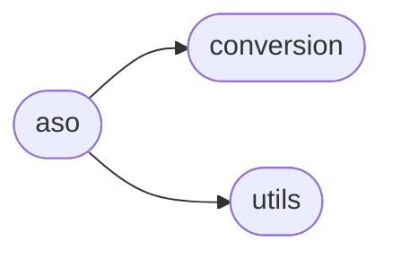
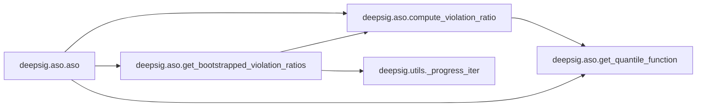
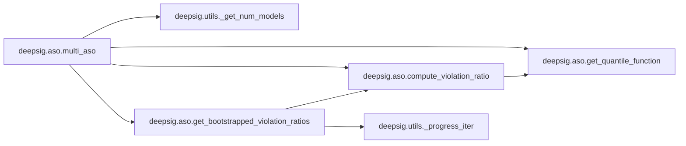
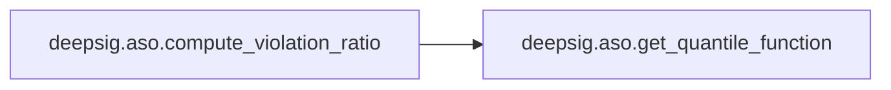
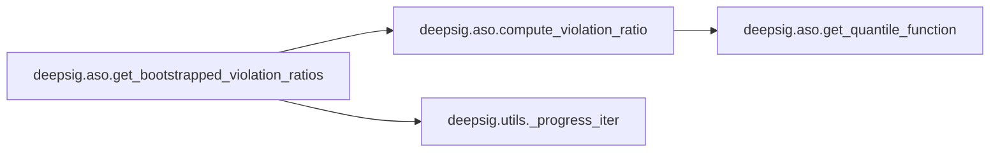

# Deepsig Aso

[_Documentation generated by Documatic_](https://www.documatic.com)

<!---Documatic-section-Codebase Structure-start--->
## Codebase Structure

<!---Documatic-block-system_architecture-start--->

<!---Documatic-block-system_architecture-end--->

# #
<!---Documatic-section-Codebase Structure-end--->

<!---Documatic-section-deepsig.aso.aso-start--->
## [deepsig.aso.aso](7-deepsig_aso.md#deepsig.aso.aso)

<!---Documatic-section-aso-start--->


### Object Calls

* [deepsig.aso.compute_violation_ratio](7-deepsig_aso.md#deepsig.aso.compute_violation_ratio)
* [deepsig.aso.get_quantile_function](7-deepsig_aso.md#deepsig.aso.get_quantile_function)
* [deepsig.aso.get_bootstrapped_violation_ratios](7-deepsig_aso.md#deepsig.aso.get_bootstrapped_violation_ratios)

<!---Documatic-block-deepsig.aso.aso-start--->
<details>
	<summary><code>deepsig.aso.aso</code> code snippet</summary>

```python
@score_pair_conversion
def aso(scores_a: ArrayLike, scores_b: ArrayLike, confidence_level: float=0.95, num_comparisons: int=1, num_samples: int=1000, num_bootstrap_iterations: int=1000, dt: float=0.005, num_jobs: int=1, show_progress: bool=True, seed: Optional[int]=None, _progress_bar: Optional[tqdm]=None) -> float:
    assert len(scores_a) > 0 and len(scores_b) > 0, 'Both lists of scores must be non-empty.'
    assert num_bootstrap_iterations > 0, 'num_samples must be positive, {} found.'.format(num_bootstrap_iterations)
    assert num_jobs > 0 or num_jobs == -1, 'Number of jobs has to be at least 1 or -1, {} found.'.format(num_jobs)
    assert num_comparisons > 0, 'Number of comparisons has to be at least 1, {} found.'.format(num_comparisons)
    if num_jobs == -1:
        num_jobs = psutil.cpu_count(logical=True)
        if num_jobs is None:
            warn('Number of available CPUs could not be determined, setting num_jobs=1.')
            num_jobs = 1
    if num_samples != 1000:
        warn("'num_samples' argument is being ignored in the current version and will be deprecated in version 1.3!", DeprecationWarning)
    if confidence_level < 0.95:
        warn(f"'confidence_level' was refactored in version 1.2.4 to be more intuitive and usually should be in the .95 -.99 range, but {confidence_level} was found. If you tried to adjust the confidence level for multiple comparisons, try the new num_comparisons argument instead.", UserWarning)
    if num_comparisons > 1:
        confidence_level += (1 - confidence_level) / num_comparisons
    violation_ratio = compute_violation_ratio(scores_a=scores_a, scores_b=scores_b, dt=dt)
    quantile_func_a = get_quantile_function(scores_a)
    quantile_func_b = get_quantile_function(scores_b)
    samples = get_bootstrapped_violation_ratios(scores_a, scores_b, quantile_func_a, quantile_func_b, num_bootstrap_iterations, dt, num_jobs, show_progress, seed, _progress_bar)
    samples = np.array(samples)
    const = np.sqrt(len(scores_a) * len(scores_b) / (len(scores_a) + len(scores_b)))
    sigma_hat = np.std(const * (samples - violation_ratio))
    min_epsilon = np.clip(violation_ratio - 1 / const * sigma_hat * normal.ppf(1 - confidence_level), 0, 1)
    return min_epsilon
```
</details>
<!---Documatic-block-deepsig.aso.aso-end--->
<!---Documatic-section-aso-end--->

# #
<!---Documatic-section-deepsig.aso.aso-end--->

<!---Documatic-section-deepsig.aso.multi_aso-start--->
## [deepsig.aso.multi_aso](7-deepsig_aso.md#deepsig.aso.multi_aso)

<!---Documatic-section-multi_aso-start--->


### Object Calls

* [deepsig.utils._get_num_models](3-deepsig_utils.md#deepsig.utils._get_num_models)
* [deepsig.aso.get_quantile_function](7-deepsig_aso.md#deepsig.aso.get_quantile_function)
* [deepsig.aso.compute_violation_ratio](7-deepsig_aso.md#deepsig.aso.compute_violation_ratio)
* [deepsig.aso.get_bootstrapped_violation_ratios](7-deepsig_aso.md#deepsig.aso.get_bootstrapped_violation_ratios)

<!---Documatic-block-deepsig.aso.multi_aso-start--->
<details>
	<summary><code>deepsig.aso.multi_aso</code> code snippet</summary>

```python
def multi_aso(scores: ScoreCollection, confidence_level: float=0.95, use_bonferroni: bool=True, use_symmetry: bool=True, num_samples: int=1000, num_bootstrap_iterations: int=1000, dt: float=0.005, num_jobs: int=1, return_df: bool=False, show_progress: bool=True, seed: Optional[int]=None) -> Union[np.array, pd.DataFrame]:
    assert num_jobs > 0 or num_jobs == -1, 'Number of jobs has to be at least 1 or -1, {} found.'.format(num_jobs)
    if num_jobs == -1:
        num_jobs = psutil.cpu_count(logical=True)
        if num_jobs is None:
            warn('Number of available CPUs could not be determined, setting num_jobs=1.')
            num_jobs = 1
    if num_samples != 1000:
        warn("'num_samples' argument is being ignored in the current version and will be deprecated in version 1.3!", DeprecationWarning)
    if not use_symmetry:
        warn("'use_symmetry' argument is being ignored in the current version and will be deprecated in version 1.3!", DeprecationWarning)
    if confidence_level < 0.95:
        warn(f"'confidence_level' was refactored in version 1.2.4 to be more intuitive and usually should be in the .95 -.99 range, but {confidence_level} was found.", UserWarning)
    num_models = _get_num_models(scores)
    num_comparisons = num_models * (num_models - 1) / 2
    eps_min = np.eye(num_models)
    if use_bonferroni:
        confidence_level += (1 - confidence_level) / num_comparisons
    indices = list(range(num_models)) if type(scores) != dict else list(scores.keys())
    progress_bar = None
    if show_progress:
        progress_bar = tqdm(range(int(num_comparisons * num_bootstrap_iterations)) if use_symmetry else range(int(num_comparisons * num_bootstrap_iterations * 2)), desc='Model comparisons')
    for (i, key_i) in enumerate(indices):
        for (j, key_j) in enumerate(indices[i + 1:], start=i + 1):
            (scores_a, scores_b) = (scores[key_i], scores[key_j])
            quantile_func_a = get_quantile_function(scores_a)
            quantile_func_b = get_quantile_function(scores_b)
            const = np.sqrt(len(scores_a) * len(scores_b) / (len(scores_a) + len(scores_b)))
            violation_ratio_ab = compute_violation_ratio(dt=dt, quantile_func_a=quantile_func_a, quantile_func_b=quantile_func_b)
            violation_ratio_ba = 1 - violation_ratio_ab
            samples_ab = get_bootstrapped_violation_ratios(scores_a, scores_b, quantile_func_a, quantile_func_b, num_bootstrap_iterations, dt, num_jobs, show_progress, seed, progress_bar)
            samples_ab = np.array(samples_ab)
            sigma_hat = np.std(const * (samples_ab - violation_ratio_ab))
            min_epsilon_ab = np.clip(violation_ratio_ab - 1 / const * sigma_hat * normal.ppf(1 - confidence_level), 0, 1)
            min_epsilon_ba = np.clip(violation_ratio_ba - 1 / const * sigma_hat * normal.ppf(1 - confidence_level), 0, 1)
            eps_min[i, j] = min_epsilon_ab
            eps_min[j, i] = min_epsilon_ba
    if type(scores) == dict and return_df:
        eps_min = pd.DataFrame(data=eps_min, index=list(scores.keys()))
        eps_min = eps_min.rename(dict(enumerate(scores.keys())), axis=1)
    return eps_min
```
</details>
<!---Documatic-block-deepsig.aso.multi_aso-end--->
<!---Documatic-section-multi_aso-end--->

# #
<!---Documatic-section-deepsig.aso.multi_aso-end--->

<!---Documatic-section-deepsig.aso.compute_violation_ratio-start--->
## [deepsig.aso.compute_violation_ratio](7-deepsig_aso.md#deepsig.aso.compute_violation_ratio)

<!---Documatic-section-compute_violation_ratio-start--->


### Object Calls

* [deepsig.aso.get_quantile_function](7-deepsig_aso.md#deepsig.aso.get_quantile_function)

<!---Documatic-block-deepsig.aso.compute_violation_ratio-start--->
<details>
	<summary><code>deepsig.aso.compute_violation_ratio</code> code snippet</summary>

```python
def compute_violation_ratio(scores_a: Optional[np.array]=None, scores_b: Optional[np.array]=None, quantile_func_a: Optional[Callable]=None, quantile_func_b: Optional[Callable]=None, dt: float=0.001) -> float:
    assert scores_a is not None or quantile_func_a is not None, 'Either scores or quantile function are required for the first sample, neither found.'
    assert scores_b is not None or quantile_func_b is not None, 'Either scores or quantile function are required for the second sample, neither found.'
    if quantile_func_a is None:
        quantile_func_a = get_quantile_function(scores_a)
    if quantile_func_b is None:
        quantile_func_b = get_quantile_function(scores_b)
    t = np.arange(dt, 1, dt)
    f = quantile_func_a(t)
    g = quantile_func_b(t)
    diff = g - f
    squared_wasserstein_dist = np.sum(diff ** 2 * dt)
    diff[f >= g] = 0
    int_violation_set = np.sum(diff[1:] ** 2 * dt)
    if squared_wasserstein_dist == 0:
        warn('Division by zero encountered in violation ratio.')
        violation_ratio = 0.5
    else:
        violation_ratio = int_violation_set / squared_wasserstein_dist
    return violation_ratio
```
</details>
<!---Documatic-block-deepsig.aso.compute_violation_ratio-end--->
<!---Documatic-section-compute_violation_ratio-end--->

# #
<!---Documatic-section-deepsig.aso.compute_violation_ratio-end--->

<!---Documatic-section-deepsig.aso.get_quantile_function-start--->
## [deepsig.aso.get_quantile_function](7-deepsig_aso.md#deepsig.aso.get_quantile_function)

<!---Documatic-section-get_quantile_function-start--->
<!---Documatic-block-deepsig.aso.get_quantile_function-start--->
<details>
	<summary><code>deepsig.aso.get_quantile_function</code> code snippet</summary>

```python
def get_quantile_function(scores: np.array) -> Callable:
    if 'np' not in dir():
        import numpy as np

    def _quantile_function(p: float) -> float:
        cdf = np.sort(scores)
        num = len(scores)
        index = int(np.ceil(num * p))
        return cdf[np.clip(index - 1, 0, num - 1)]
    return np.vectorize(_quantile_function)
```
</details>
<!---Documatic-block-deepsig.aso.get_quantile_function-end--->
<!---Documatic-section-get_quantile_function-end--->

# #
<!---Documatic-section-deepsig.aso.get_quantile_function-end--->

<!---Documatic-section-deepsig.aso.get_bootstrapped_violation_ratios-start--->
## [deepsig.aso.get_bootstrapped_violation_ratios](7-deepsig_aso.md#deepsig.aso.get_bootstrapped_violation_ratios)

<!---Documatic-section-get_bootstrapped_violation_ratios-start--->


### Object Calls

* [deepsig.aso.compute_violation_ratio](7-deepsig_aso.md#deepsig.aso.compute_violation_ratio)
* [deepsig.utils._progress_iter](3-deepsig_utils.md#deepsig.utils._progress_iter)

<!---Documatic-block-deepsig.aso.get_bootstrapped_violation_ratios-start--->
<details>
	<summary><code>deepsig.aso.get_bootstrapped_violation_ratios</code> code snippet</summary>

```python
def get_bootstrapped_violation_ratios(scores_a: ArrayLike, scores_b: ArrayLike, quantile_func_a: Callable, quantile_func_b: Callable, num_bootstrap_iterations: int, dt: float, num_jobs: int, show_progress: bool, seed: Optional[int], _progress_bar: Optional[tqdm]) -> List[float]:
    if show_progress and _progress_bar is None:
        iters = tqdm(range(num_bootstrap_iterations), desc='Bootstrap iterations')
    elif _progress_bar is not None:
        iters = _progress_iter(num_bootstrap_iterations, _progress_bar)
    else:
        iters = range(num_bootstrap_iterations)
    seeds = [None] * num_bootstrap_iterations if seed is None else [seed + offset for offset in range(1, num_bootstrap_iterations + 1)]

    @wrap_non_picklable_objects
    def _bootstrap_iter(seed: Optional[int]=None):
        """
        One bootstrap iteration. Wrapped in a function so it can be handed to joblib.Parallel.
        """
        if 'numpy' not in dir() or 'deepsig' not in dir():
            import numpy as np
            from deepsig.aso import compute_violation_ratio
        if seed is not None:
            np.random.seed(seed)
        sampled_scores_a = quantile_func_a(np.random.uniform(0, 1, len(scores_a)))
        sampled_scores_b = quantile_func_b(np.random.uniform(0, 1, len(scores_b)))
        sample = compute_violation_ratio(scores_a=sampled_scores_a, scores_b=sampled_scores_b, dt=dt)
        return sample
    parallel = Parallel(n_jobs=num_jobs)
    samples = parallel((delayed(_bootstrap_iter)(seed) for (seed, _) in zip(seeds, iters)))
    return samples
```
</details>
<!---Documatic-block-deepsig.aso.get_bootstrapped_violation_ratios-end--->
<!---Documatic-section-get_bootstrapped_violation_ratios-end--->

# #
<!---Documatic-section-deepsig.aso.get_bootstrapped_violation_ratios-end--->

[_Documentation generated by Documatic_](https://www.documatic.com)