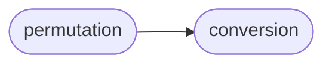

# Deepsig Permutation

[_Documentation generated by Documatic_](https://www.documatic.com)

<!---Documatic-section-Codebase Structure-start--->
## Codebase Structure

<!---Documatic-block-system_architecture-start--->

<!---Documatic-block-system_architecture-end--->

# #
<!---Documatic-section-Codebase Structure-end--->

<!---Documatic-section-deepsig.permutation.permutation_test-start--->
## [deepsig.permutation.permutation_test](8-deepsig_permutation.md#deepsig.permutation.permutation_test)

<!---Documatic-section-permutation_test-start--->
<!---Documatic-block-deepsig.permutation.permutation_test-start--->
<details>
	<summary><code>deepsig.permutation.permutation_test</code> code snippet</summary>

```python
@score_pair_conversion
def permutation_test(scores_a: ArrayLike, scores_b: ArrayLike, num_samples: int=1000, num_jobs: int=1, seed: Optional[int]=None) -> float:
    assert len(scores_a) == len(scores_b), 'Scores have to be of same length.'
    assert len(scores_a) > 0 and len(scores_b) > 0, 'Both lists of scores must be non-empty.'
    assert num_samples > 0, 'num_samples must be positive, {} found.'.format(num_samples)
    N = len(scores_a)
    delta = np.mean(scores_a - scores_b)
    seeds = [None] * num_samples if seed is None else [seed + offset for offset in range(1, num_samples + 1)]

    def _bootstrap_iter(delta: float, seed: Optional[int]=None):
        """
        One bootstrap iteration. Wrapped in a function so it can be handed to joblib.Parallel.
        """
        if 'np' not in dir():
            import numpy as np
        if seed is not None:
            np.random.seed(seed)
        (swapped_a, swapped_b) = zip(*[(scores_a[i], scores_b[i]) if np.random.rand() > 0.5 else (scores_b[i], scores_a[i]) for i in range(N)])
        (swapped_a, swapped_b) = (np.array(swapped_a), np.array(swapped_b))
        return int(np.mean(swapped_a - swapped_b) >= delta)
    parallel = Parallel(n_jobs=num_jobs)
    samples = parallel((delayed(_bootstrap_iter)(delta, seed) for (_, seed) in zip(range(num_samples), seeds)))
    p_value = (sum(samples) + 1) / (num_samples + 1)
    return p_value
```
</details>
<!---Documatic-block-deepsig.permutation.permutation_test-end--->
<!---Documatic-section-permutation_test-end--->

# #
<!---Documatic-section-deepsig.permutation.permutation_test-end--->

[_Documentation generated by Documatic_](https://www.documatic.com)