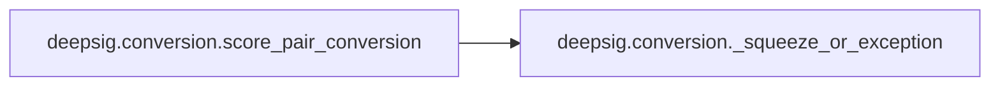
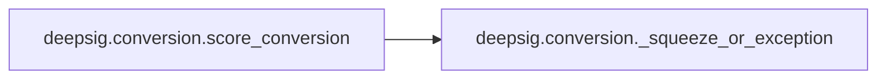

# Deepsig Conversion

[_Documentation generated by Documatic_](https://www.documatic.com)

<!---Documatic-section-Codebase Structure-start--->
## Codebase Structure

<!---Documatic-block-system_architecture-start--->
```mermaid
None
```
<!---Documatic-block-system_architecture-end--->

# #
<!---Documatic-section-Codebase Structure-end--->

<!---Documatic-section-deepsig.conversion.extend_type-start--->
## [deepsig.conversion.extend_type](9-deepsig_conversion.md#deepsig.conversion.extend_type)

<!---Documatic-section-extend_type-start--->
<!---Documatic-block-deepsig.conversion.extend_type-start--->
<details>
	<summary><code>deepsig.conversion.extend_type</code> code snippet</summary>

```python
def extend_type(type_: type, new_type: type) -> type:
    type_.__args__ = (new_type, *type_.__args__)
    return type_
```
</details>
<!---Documatic-block-deepsig.conversion.extend_type-end--->
<!---Documatic-section-extend_type-end--->

# #
<!---Documatic-section-deepsig.conversion.extend_type-end--->

<!---Documatic-section-deepsig.conversion.score_pair_conversion-start--->
## [deepsig.conversion.score_pair_conversion](9-deepsig_conversion.md#deepsig.conversion.score_pair_conversion)

<!---Documatic-section-score_pair_conversion-start--->


### Object Calls

* [deepsig.conversion._squeeze_or_exception](9-deepsig_conversion.md#deepsig.conversion._squeeze_or_exception)

<!---Documatic-block-deepsig.conversion.score_pair_conversion-start--->
<details>
	<summary><code>deepsig.conversion.score_pair_conversion</code> code snippet</summary>

```python
def score_pair_conversion(func: Callable) -> Callable:

    @wraps(func)
    def with_score_pair_conversion(scores_a: ArrayLike, scores_b: ArrayLike, *args, **kwargs):
        conversion_func_a = CONVERSIONS[type(scores_a)]
        conversion_func_b = CONVERSIONS[type(scores_b)]
        scores_a = conversion_func_a(scores_a)
        scores_b = conversion_func_b(scores_b)

        def _squeeze_or_exception(array: np.array, name: str) -> np.array:
            dims = len(array.shape)
            if dims > 1:
                if dims == 2 and array.shape[-1] == 1:
                    array = np.squeeze(array, axis=1)
                else:
                    raise TypeError('{} has to be one-dimensional, {} found.'.format(name, dims))
            return array
        scores_a = _squeeze_or_exception(scores_a, 'scores_a')
        scores_b = _squeeze_or_exception(scores_b, 'scores_b')
        return func(scores_a, scores_b, *args, **kwargs)
    return with_score_pair_conversion
```
</details>
<!---Documatic-block-deepsig.conversion.score_pair_conversion-end--->
<!---Documatic-section-score_pair_conversion-end--->

# #
<!---Documatic-section-deepsig.conversion.score_pair_conversion-end--->

<!---Documatic-section-deepsig.conversion.score_conversion-start--->
## [deepsig.conversion.score_conversion](9-deepsig_conversion.md#deepsig.conversion.score_conversion)

<!---Documatic-section-score_conversion-start--->


### Object Calls

* [deepsig.conversion._squeeze_or_exception](9-deepsig_conversion.md#deepsig.conversion._squeeze_or_exception)

<!---Documatic-block-deepsig.conversion.score_conversion-start--->
<details>
	<summary><code>deepsig.conversion.score_conversion</code> code snippet</summary>

```python
def score_conversion(func: Callable) -> Callable:

    @wraps(func)
    def with_score_conversion(scores: ArrayLike, *args, **kwargs):
        conversion_func = CONVERSIONS[type(scores)]
        scores = conversion_func(scores)
        scores = _squeeze_or_exception(scores, 'p_values')
        return func(scores, *args, **kwargs)
    return with_score_conversion
```
</details>
<!---Documatic-block-deepsig.conversion.score_conversion-end--->
<!---Documatic-section-score_conversion-end--->

# #
<!---Documatic-section-deepsig.conversion.score_conversion-end--->

<!---Documatic-section-deepsig.conversion._squeeze_or_exception-start--->
## [deepsig.conversion._squeeze_or_exception](9-deepsig_conversion.md#deepsig.conversion._squeeze_or_exception)

<!---Documatic-section-_squeeze_or_exception-start--->
<!---Documatic-block-deepsig.conversion._squeeze_or_exception-start--->
<details>
	<summary><code>deepsig.conversion._squeeze_or_exception</code> code snippet</summary>

```python
def _squeeze_or_exception(array: np.array, name: str) -> np.array:
    dims = len(array.shape)
    if dims > 1:
        if dims == 2 and array.shape[-1] == 1:
            array = np.squeeze(array, axis=1)
        else:
            raise TypeError('{} has to be one-dimensional, {} found.'.format(name, dims))
    return array
```
</details>
<!---Documatic-block-deepsig.conversion._squeeze_or_exception-end--->
<!---Documatic-section-_squeeze_or_exception-end--->

# #
<!---Documatic-section-deepsig.conversion._squeeze_or_exception-end--->

[_Documentation generated by Documatic_](https://www.documatic.com)